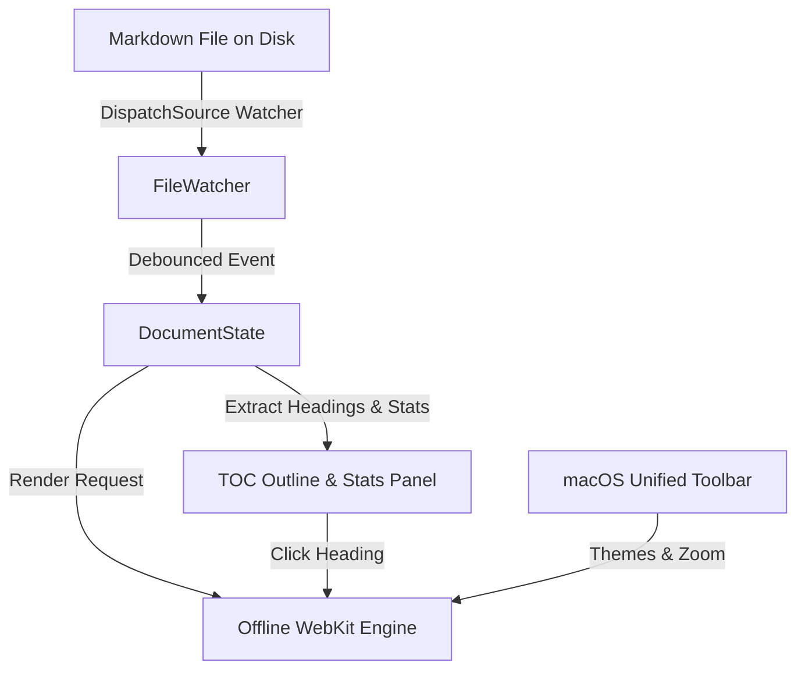

# MDViewer: Native macOS Markdown Viewer

Welcome to **MDViewer**, an ultra-fast, native macOS markdown reader and previewer designed for maximum reading comfort, real-time live synchronization, and elegant macOS HIG design.

> [!NOTE]
> This document demonstrates the full feature set of MDViewer, including GitHub Flavored Markdown, code syntax highlighting, KaTeX mathematics, and Mermaid diagrams.

---

## 1. System Architecture

MDViewer employs a hybrid native AppKit architecture with an offline WebKit rendering canvas:



### Key Components

- **Kernel File Watcher**: Uses `DispatchSource.makeFileSystemObjectSource` to watch file descriptor events.
- **Scroll Position Sync**: Preserves exact scroll coordinates on live updates when files are saved externally in Vim or VS Code.
- **Offline Bundle**: 100% self-contained—zero internet access required at runtime.

---

## 2. Mathematics and Equations (KaTeX)

MDViewer features high-fidelity TeX typography powered by bundled KaTeX.

### Inline Formula
Einstein's mass-energy equivalence is given by $E = mc^2$, where $c \approx 3 \times 10^8 \text{ m/s}$.

### Display Equations

The Gaussian distribution integral:

$$\int_{-\infty}^{\infty} e^{-x^2} \, dx = \sqrt{\pi}$$

Euler's identity, linking five fundamental constants:

$$e^{i\pi} + 1 = 0$$

Maxwell's equations in differential form:

$$\nabla \cdot \mathbf{E} = \frac{\rho}{\varepsilon_0}, \quad \nabla \cdot \mathbf{B} = 0$$
$$\nabla \times \mathbf{E} = -\frac{\partial \mathbf{B}}{\partial t}, \quad \nabla \times \mathbf{B} = \mu_0 \mathbf{J} + \mu_0 \varepsilon_0 \frac{\partial \mathbf{E}}{\partial t}$$

---

## 3. Code Syntax Highlighting

Code blocks include language labels and a one-click **Copy** button.

### Swift

```swift
import AppKit
import WebKit

@MainActor
public final class MainWindowController: NSWindowController {
    public init() {
        let window = NSWindow(
            contentRect: NSRect(x: 100, y: 100, width: 1080, height: 750),
            styleMask: [.titled, .closable, .miniaturizable, .resizable, .fullSizeContentView],
            backing: .buffered,
            defer: false
        )
        super.init(window: window)
        window.title = "MDViewer"
    }
}
```

### Python

```python
import asyncio
from pathlib import Path

async def monitor_document(path: Path) -> None:
    """Continuously monitor a markdown file for changes."""
    last_mtime = path.stat().st_mtime
    while True:
        await asyncio.sleep(0.1)
        current_mtime = path.stat().st_mtime
        if current_mtime != last_mtime:
            last_mtime = current_mtime
            print(f"Document updated: {path.name}")
```

### Rust

```rust
use std::fs::File;
use std::io::{self, Read};

pub fn read_markdown(path: &str) -> io::Result<String> {
    let mut file = File::open(path)?;
    let mut contents = String::new();
    file.read_to_string(&mut contents)?;
    Ok(contents)
}
```

---

## 4. Tables and Task Lists

### Feature Comparison Matrix

| Feature | MDViewer | Standard QuickLook | Web Previewers |
| :--- | :---: | :---: | :---: |
| **Instant Live Sync** | ✅ Yes | ❌ No | ⚠️ Partial |
| **KaTeX Math** | ✅ Yes | ❌ No | ✅ Yes |
| **Mermaid Diagrams** | ✅ Yes | ❌ No | ⚠️ Slow |
| **Interactive TOC Outline** | ✅ Yes | ❌ No | ❌ No |
| **Zero Network Overhead** | ✅ 100% Offline | ✅ Offline | ❌ Online |
| **Dark / Light Themes** | ✅ 6 Built-in Themes | ⚠️ System only | ⚠️ Limited |

### Development Roadmap Checklist

- [x] Design architecture and user experience specification
- [x] Setup Swift Package Manager project with AppKit & WebKit
- [x] Bundle offline Marked.js, Highlight.js, KaTeX, and Mermaid.js assets
- [x] Implement kernel `FileWatcher` with debounced live reload
- [x] Implement Table of Contents parser and dynamic sidebar
- [x] Implement in-page search bar with match navigation
- [x] Add PDF export and HTML clipboard copying
- [ ] Add custom CSS theme editor in preferences

---

## 5. GitHub Callouts & Blockquotes

> [!TIP]
> Use `Cmd + Option + S` to quickly toggle the Table of Contents sidebar.

> [!WARNING]
> When editing large files in external editors, atomic file renames are automatically handled by the kernel event listener.

> [!CAUTION]
> Avoid modifying system files directly without proper backup.

---

## 6. Keyboard Shortcuts

| Shortcut | Description |
| :--- | :--- |
| `Cmd + O` | Open a markdown document via file dialog |
| `Cmd + R` | Force reload the current document |
| `Cmd + Option + S` | Toggle Outline Sidebar |
| `Cmd + F` | Toggle in-page search bar |
| `Cmd + P` | Export document to PDF |
| `Cmd + Shift + C` | Copy rendered HTML to clipboard |
| `Cmd + +` / `Cmd + -` | Increase / Decrease font size |
| `Cmd + 0` | Reset font size to default |
